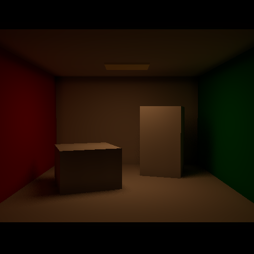
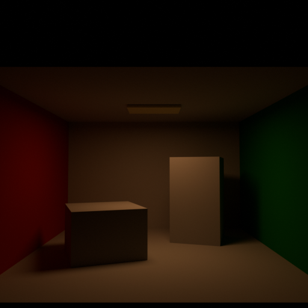
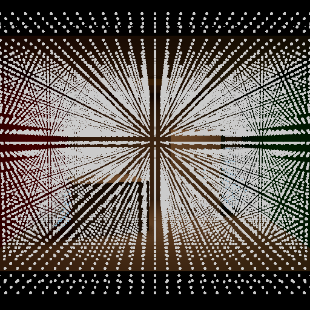

# Area Cornell V0.9B Benchmark

这是 Local LRT V0.9B Area Light 的单灯 benchmark。Godot 与 Blender 共用 Cornell 几何、相机、Lambertian 材质、黑色 World、AgX 和 Exposure 0；Directional、Omni、Spot 与 Geometry emission 均关闭。

## 输入标定

- Godot：矩形 Area，位置 `(0, 2.2, 0.5)`，尺寸 `2.0 × 1.2 m`，向下单面发光，Energy `5.0`，Range `50 m`，Attenuation `2.0`，Normalize Energy 开启。
- Blender：Rectangle Area，位置 `(0, -0.5, 2.2)`，尺寸 `2.0 × 1.2 m`，Power `49.3480225 W`。
- 换算：`Blender Area Power = π² × Godot Area Energy`；Godot authored sRGB `(1, 0.72, 0.48)` 对应 Blender linear `(1, 0.4770, 0.195994)`。

## 标准输出

- `godot_direct_only_agx.png`、`godot_gi_only_agx.png`、`godot_combined_agx.png`。
- `godot_area_shadow_debug.png`：Area Shadow Visibility 探针。
- `cycles_direct_linear.exr`、`cycles_indirect_linear.exr`、`cycles_combined_linear.exr`。
- `cycles_direct_agx.png`、`cycles_indirect_agx.png`、`cycles_reference_agx.png`。
- `cycles_half_energy_*_linear.exr`：Energy `2.5` 的线性缩放对照。

Cycles 半能量与全能量线性均值比为 Direct `0.5000005`、Indirect `0.4999729`、Combined `0.4999926`。Godot GPU Injection 半能量比为 `0.5`。

运行时隔两格抽样得到 Shadow Visibility 范围 `0–1`，其中 `451` 个半影探针、`284` 个强遮挡探针；移动 Area Light 后代表半影探针由 `0.75` 变为 `0.375`，静态 Geometry count 保持 `8`。

