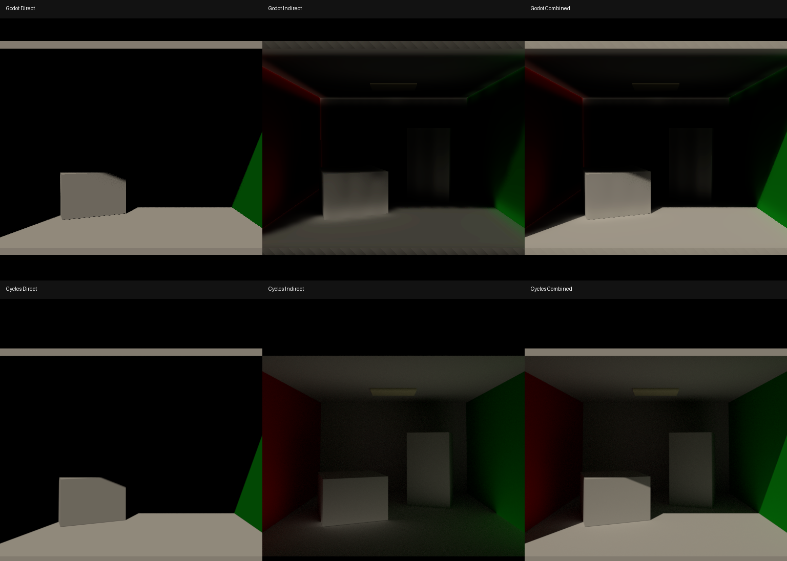

# Directional Cornell V0.8 Benchmark

这是 Local LRT V0.8 Directional-only 的冻结 benchmark。它用于比较物理输入、Direct、GI-only 和 Combined，不用于 Omni、Area、Spot 或 Emission。

## 场景

- Godot：`../../test_project/cornell_box.tscn`
- Blender：`cornell_directional_cycles.blend`
- 机器可读配置与数值：`benchmark.json`

Blender 文件内保存了 `godot_directional_energy`、`blender_sun_strength` 和 `directional_energy_mapping` 自定义属性。标准换算为：

```text
Blender Sun Strength = π × Godot Directional Energy
5.0 = π × 1.5915494
```

## 标准 pass

- `cycles_direct_linear.exr`：Cycles Diffuse Direct，线性 HDR。
- `cycles_indirect_linear.exr`：Cycles Diffuse Indirect，线性 HDR。
- `cycles_combined_linear.exr`：Cycles Combined，线性 HDR。
- `godot_indirect_linear_half.png`：修复后 Godot Directional GI-only 线性捕获。
- `cycles_reference_agx.png`：Cycles 标准 AgX Combined。
- `godot_combined_agx.png`：Godot 标准 AgX Combined。
- `direct_indirect_combined_comparison.png`：Godot / Cycles 的 Direct、Indirect、Combined 六宫格。
- `cycles_user_lookdev_reference.png`：用户提供的原始 Cycles LookDev 参考，仅用于视觉目标，不参与数值验收。



## 冻结设置

- 仅启用 Directional Light。
- 黑色 World，无环境光，无 Geometry emission。
- 相同 Cornell geometry、box rotation、camera transform、FOV 52° 和 512×512 framing。
- Godot Directional Energy `1.5915494`，Blender Sun Strength `5.0`。
- Light angular diameter `0.5°`。
- AgX，Exposure `0`。
- Cycles 512 samples、32 diffuse bounces、no denoise、direct/indirect clamp `0`。
- Godot Local LRT `probe_spacing = 0.25 m`、`propagation_iterations = 16`，跨帧继续收敛。

## 验收顺序

1. Direct：冻结灯强、颜色、材质、相机、曝光。
2. GI-only：在线性 pass 中比较阴影区、受光地面、Color Bleeding 和总能量。
3. Combined：只做最终 LookDev 判断，不反向修改已通过的 Direct 标定。

验收标准：

- Direct 代表点每通道误差 `< 1%`。
- Tall Box 阴影面 GI-only 每通道误差 `< 10%`。
- Floor GI-only 平均亮度误差 `< 20%`。
- 灯强缩放保持近似线性。
- 不允许一格接触间距、反向半球光环、近场过曝同时阴影区缺能。

## 重现

Godot 使用当前自定义编辑器打开 `../../test_project/project.godot`，运行 `cornell_box.tscn`。Blender 打开 `cornell_directional_cycles.blend` 后直接渲染；场景已保存标准 Cycles 和颜色管理设置。

实现分析、公式与验证记录见 `../../LOCAL_LRT_V08_DIRECTIONAL_FIX_REPORT.md`。
