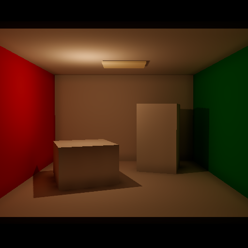
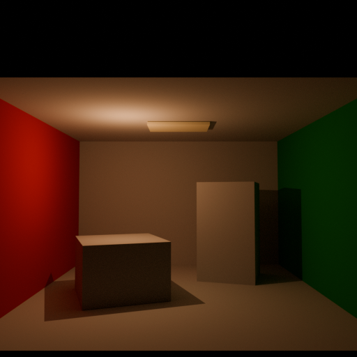
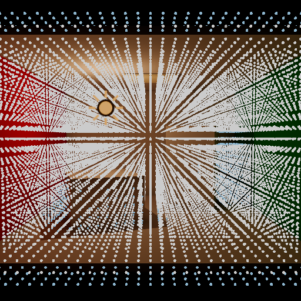

# Omni Cornell V0.9A Benchmark

这是 Local LRT V0.9A Point / Omni 的单灯 benchmark。Godot 与 Blender 共用 Cornell 几何、相机、Lambertian 材质、黑色 World、AgX 和 Exposure 0；Directional、Spot 与 Geometry emission 均关闭。

## 输入标定

- Godot：Omni Energy `4.0`、Range `50 m`、Attenuation `2.0`、位置 `(-1.4, 1.2, 0.8)`。
- Blender：Point Power `157.9136704 W`、位置 `(-1.4, -0.8, 1.2)`。
- 换算：`Blender Point Power = 4π² × Godot Omni Energy`。
- Godot Range `50 m` 使当前 Volume 内有限范围 window 相对理想平方反比的偏差 `< 0.2%`。

## 标准输出

- `godot_direct_only_agx.png`、`godot_gi_only_agx.png`、`godot_combined_agx.png`。
- `godot_omni_shadow_debug.png`：Omni Shadow Visibility 探针。
- `cycles_direct_linear.exr`、`cycles_indirect_linear.exr`、`cycles_combined_linear.exr`。
- `cycles_direct_agx.png`、`cycles_indirect_agx.png`、`cycles_reference_agx.png`。
- `cycles_half_energy_*_linear.exr`：Energy `2.0` 的线性缩放对照。

Cycles 的 Direct / Indirect 输出已分别乘 `Diffuse Color`。半能量与全能量线性均值比为 Direct `0.4999825`、Indirect `0.5026028`、Combined `0.5008565`。

运行时 Omni Shadow Visibility 代表探针结果为 `[1, 1, 0, 1]`，覆盖无遮挡、遮挡与另一侧无遮挡区域；六主轴、双抛物面边界和 reversed-depth compare 另由单元测试覆盖。

