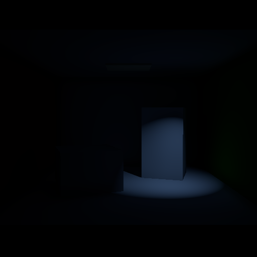
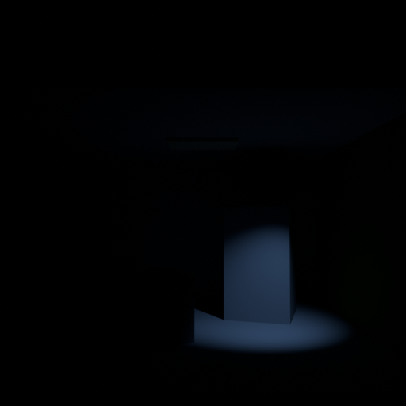
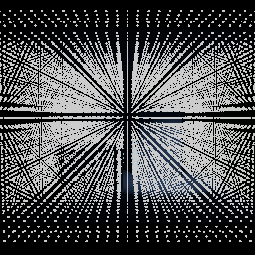

# Spot Cornell V0.9C Benchmark

这是 Local LRT V0.9C Spot Light 的单灯 benchmark。Godot 与 Blender 共用 Cornell 几何、相机、Lambertian 材质、黑色 World、AgX 和 Exposure 0；Directional、Omni、Area 与 Geometry emission 均关闭。

## 输入标定

- Godot：Spot 位置 `(2.2, 1.6, 1.8)`，方向 `(-0.181243, -0.848048, -0.497961)`，半锥角 `32°`，Angle Attenuation `1.0`，Energy `5.0`，Range `50 m`，Attenuation `2.0`。
- Blender：Spot 位置 `(2.2, -1.8, 1.6)`，方向 `(-0.181243, 0.497961, -0.848048)`，Spot Size `64°`，Blend `1.0`，Power `197.3920898 W`。
- 换算：`Blender Spot Power = 4π² × Godot Spot Energy`；Godot authored sRGB `(0.58, 0.72, 1.0)` 对应 Blender linear `(0.295699, 0.4770, 1.0)`。

## 标准输出

- `godot_direct_only_agx.png`、`godot_gi_only_agx.png`、`godot_combined_agx.png`。
- `godot_spot_shadow_debug.png`：Spot Shadow Visibility 探针。
- `cycles_direct_linear.exr`、`cycles_indirect_linear.exr`、`cycles_combined_linear.exr`。
- `cycles_direct_agx.png`、`cycles_indirect_agx.png`、`cycles_reference_agx.png`。
- `cycles_half_energy_*_linear.exr`：Energy `2.5` 的线性缩放对照。

Cycles 半能量与全能量线性均值比为 Direct `0.4999993`、Indirect `0.4999298`、Combined `0.4999791`。Godot Injection 半能量比为 `0.5`。

Runtime Shadow Visibility 范围为 `0–1`，其中 `6366` 个 Probe 被遮挡、`19` 个 Probe 为 4-tap PCF 分数值；旋转 Spot 后注入 Probe 数由 `3397` 变为 `3460`，静态 Geometry count 保持 `8`。

