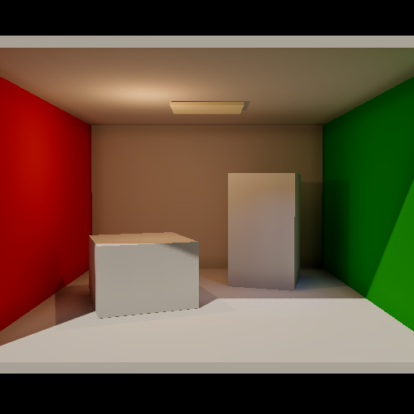
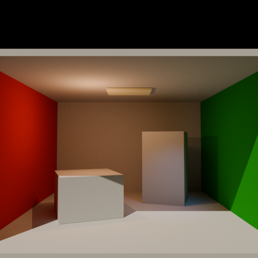
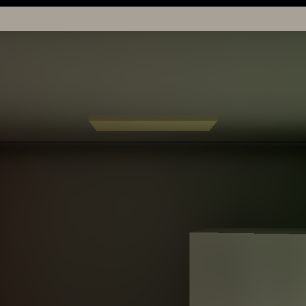
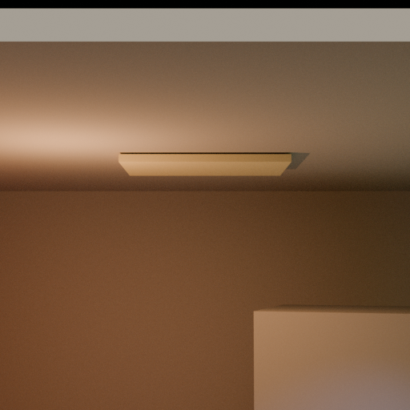
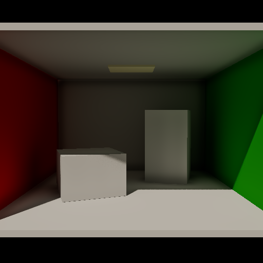
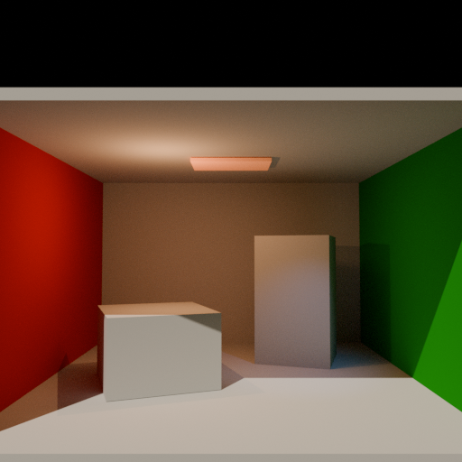
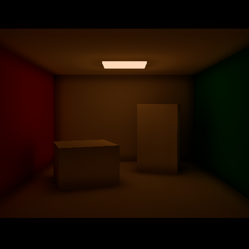
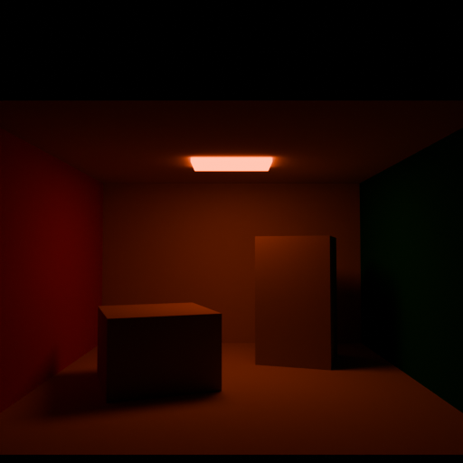

# Local LRT v0 总验收 Cornell Benchmark

本 benchmark 同时覆盖 Directional、Omni、Area、Spot、Geometry Emission 增量以及独立 Emission Mesh。Godot 与 Blender 共用 Cornell 几何、相机、Lambertian 材质、黑色 World、512×512、AgX 和 Exposure 0。

解析灯严格使用 `Shadow → Injection → 26-neighbor gather → current-probe Local Visibility → Local Transfer → Forward`。Emission Mesh 同时在 Base Pass 显示 authored emission，并按 PDF 的 `MeshLightSH → InComingLight → current-probe Local Visibility → Local Transfer` 产生 GI；PDF 5.11 的 LTM 自发光增益独立使用 `ColorToFill = albedo + transfer_emission`。Multiplier 只缩放 MeshLight source，避免 source 与 LTM 同时放大造成超线性。实现中不存在绕过 LTM 的 outgoing emission 注入通道，也没有隐藏解析灯替代 Emission Mesh。

## 场景与输出

- `cornell_v0_acceptance.tscn` / `cornell_v0_acceptance_cycles.blend`：四类解析灯组合，Geometry emission 关闭。
- `cornell_v0_emission.tscn` / `cornell_v0_emission_cycles.blend`：在相同四灯输入上启用暖色 Geometry emission。
- `cornell_v0_emission_mesh.tscn` / `cornell_v0_emission_mesh_cycles.blend`：关闭全部四类解析灯，仅由真实 Emission Mesh 照亮场景；Cycles 使用 Diffuse + Emission shader。
- `godot_combined_agx.png` / `cycles_combined_agx.png`：四灯组合结果。
- `godot_emission_agx.png` / `cycles_emission_gain_agx.png`：Emission 经 Local Transfer 的增量结果。
- `godot_emission_mesh_agx.png` / `cycles_emission_mesh_agx.png`：独立 Emission Mesh 的 Godot Local LRT / Cycles 对照。
- `godot_combined_corner_regression.png` / `cycles_combined_corner_regression.png`：四灯场景墙顶夹角近景；验证 Probe 间距不再产生周期黑斑断层。
- `godot_scene_switch_before.png` / `godot_scene_switch_after.png`：同一 runtime 进程在 `Cornell → Sky → Cornell` 前后的输出；两张 PNG 的 SHA-256 完全一致。

Godot MCP 运行验证确认四灯同时启用，移动 Area 后静态 Geometry count 保持 `8 → 8`；独立 Emission Mesh 场的四灯均为 `visible=false`。BaseMaterial3D 到 MeshLight source 使用冻结的 `64.0` v0 Cornell/Cycles 适配系数，因此 Godot Multiplier `8` 对照 Cycles Strength `8`。`84525` 个 Radiance SH 值中 `61368` 个非零，最大分量 `4.1105776`；Multiplier `16` 时为 `8.2211552`，精确 `2.0000×`。能量为 `0` 时 Radiance 全零。最终 current run 无项目脚本或渲染错误；编辑器仅报告外部 Vulkan layer/OBS hook 警告。

