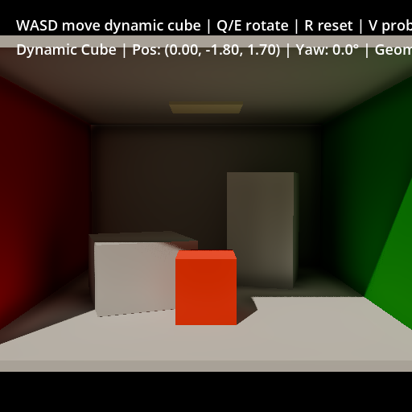
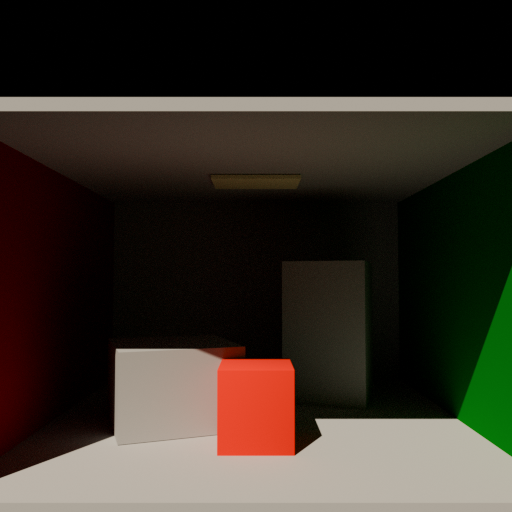
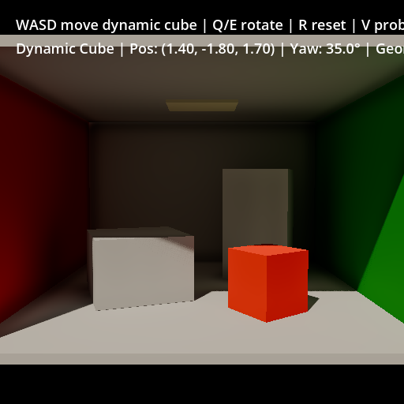
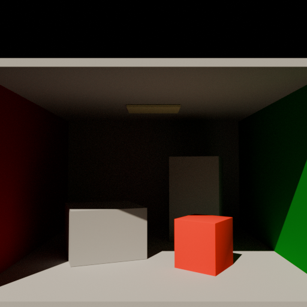

# Local LRT V1.1 Dynamic Geometry Cornell Benchmark

本 benchmark 在 V0 Directional Cornell 基准上增加一个红色动态 Cube。Godot 将其设为 `GI_MODE_DYNAMIC`，Cube 平移 / 旋转时不调用 `rebuild()`；Local LRT 自动重建完整 Local Geometry / Visibility / Transfer / MeshLight，并重置 Radiance。

PDF 5.10 的查询约定保持不变：Probe 查询位置变换到逐物件 Local Color SDF 后读取 26 邻域，动态阶段不引入独立传播路径。Blender Cycles 文件包含 frame 1 / 2 两个对应位置，512×512、512 samples、AgX。

## 验证结果

- A → B 后 Geometry count 保持 `9`。
- A 的中心 Probe 在 B 状态下 `inside_solid=false`，B 的中心 Probe 为 `inside_solid=true`，旧位置已清理。
- GPU Radiance 总量 `24872.6215 → 23894.4382`，X 空间矩 `429888.6752 → 399344.7801`，证明最终光场随动态遮挡 / 反射更新。
- 全量单元测试 `1415 passed / 424533 assertions / 0 failed / 3 skipped`。
- Godot current run 无项目错误；编辑器仅有外部 Vulkan registry / OBS layer 警告。

